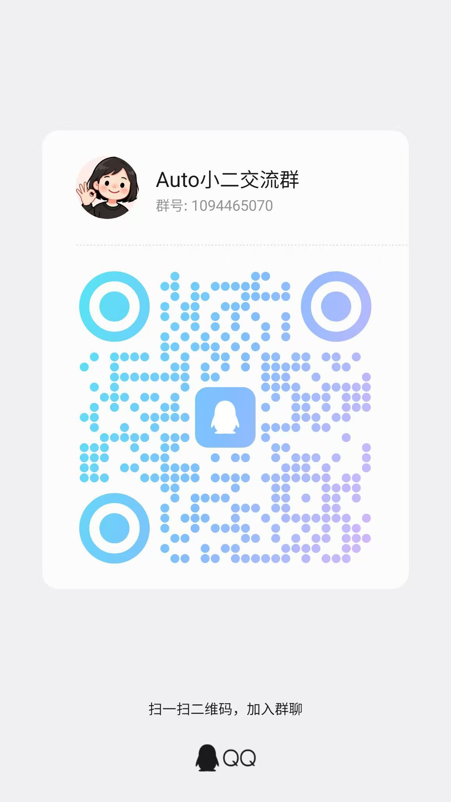

# Auto小二

> “哐哐哐，我来啦！”

中文 | [English](README_en.md)

## 📽️视频介绍
请查看B站视频：[手机里的全能智能体，Auto小二开源啦](https://www.bilibili.com/video/BV1S7dWBWE3S)

获取最新开发资讯，请关注: [小二开发日记](https://space.bilibili.com/7090735/lists/7991306)

## 📸 应用截图

<table>
  <tr>
    <td></td>
    <td></td>
    <td></td>
  </tr>
  <tr>
    <td></td>
    <td></td>
    <td></td>
  </tr>
</table>

---

## 📖 项目简介
Auto Xiao'er 是基于 [AutoGLM For Android](https://github.com/Luokavin/AutoGLM-For-Android) 深度修改开发的 Android 原生应用。借鉴一些 OpenClaw 思想，使它可以独立操作手机，成为你的赛博伙伴。

> AutoGLM For Android 是基于 [Open-AutoGLM](https://github.com/zai-org/Open-AutoGLM) 开源项目二次开发的 Android 原生应用。它将原本需要电脑 + ADB 连接的手机自动化方案，转变为一个独立运行在手机上的 App，让用户可以直接在手机上使用自然语言控制手机完成各种任务。

**核心特点：**
- 🚀 **纯端侧**：直接在手机上运行，无需与电脑连接
- 🎯 **无缝对接各种社交软件**：基于视觉操作，手机上可以安装的社交软件都可以使用
- 🤖 **双Agent协同**：大语言模型+视觉操作模型协同，更聪明的智能体
- ⏰ **定时任务**：支持定时执行任务，可设置重复模式，自动亮屏执行
- 🔔 **通知触发**：监听指定 App 的通知，收到通知时自动触发预设任务
- 📶 **微信远程控制**：通过微信扫码连接 ClawBot，随时随地用微信与小二连接
- 🔒 **Shizuku 权限**：通过 Shizuku 获取必要的系统权限
- 🪟 **悬浮窗交互**：悬浮窗实时显示任务执行进度
- 📱 **原生体验**：Material Design 设计，流畅的原生 Android 体验
- 🔌 **多模型支持**：兼容任何支持 OpenAI 格式的模型 API

## 📋 功能特性

### 核心功能

- ✅ **任务执行**：输入自然语言任务描述，AI 自动规划并执行
- ✅ **屏幕理解**：截图 → 视觉模型分析 → 输出操作指令
- ✅ **多种操作**：点击、滑动、长按、双击、输入文本、启动应用等
- ✅ **任务控制**：暂停、继续、取消任务执行
- ✅ **历史记录**：保存任务执行历史，支持查看详情和截图
- ✅ **定时任务**：预设任务在指定时间自动执行，支持一次性和重复任务
- ✅ **通知触发任务**：监听指定 App 通知，自动触发对应任务
- ✅ **微信远程控制（ClawBot）**：通过微信扫码连接，远程发送指令并接收任务执行反馈

### 用户界面

- ✅ **主界面**：任务输入、状态显示、快捷操作
- ✅ **悬浮窗**：实时显示执行步骤、思考过程、操作结果
- ✅ **设置页面**：模型配置、Agent 参数、多配置管理
- ✅ **历史页面**：任务历史列表、详情查看、截图标注

### 高级功能

- ✅ **多模型配置**：支持保存多个模型配置，快速切换
- ✅ **自定义 Prompt**：支持自定义系统提示词
- ✅ **快捷磁贴**：通知栏快捷磁贴，快速打开悬浮窗
- ✅ **日志导出**：支持导出调试日志，自动脱敏敏感信息

## 📱 系统要求

- **Android 版本**：Android 7.0 (API 24) 及以上
- **必需应用**：[Shizuku](https://shizuku.rikka.app/) (用于获取系统权限)
- **网络连接**：需要连接到模型 API 服务（支持任何 OpenAI 格式兼容的视觉模型）
- **权限要求**：
  - 悬浮窗权限 (用于显示悬浮窗)
  - 网络权限 (用于 API 通信)
  - 后台运行权限（用于后台执行任务）
  - Shizuku 权限 (用于执行系统操作)
  - 通知监听权限 (可选，用于通知触发任务功能)

## 🚀 快速开始 （同 AutoGLM-For-Android）

### 第一步：安装并激活 Shizuku

Shizuku 是本应用的核心依赖，用于执行屏幕点击、滑动等操作。

**下载安装**

- [Google Play 下载](https://play.google.com/store/apps/details?id=moe.shizuku.privileged.api)
- [GitHub 下载](https://github.com/RikkaApps/Shizuku/releases)

**激活方式（三选一）**

| 方式      | 适用场景       | 持久性           |
| --------- | -------------- | ---------------- |
| 无线调试  | 推荐，无需电脑 | 重启后需重新配对 |
| ADB 连接  | 有电脑时使用   | 重启后需重新执行 |
| Root 授权 | 已 Root 设备   | 永久有效         |

**无线调试激活步骤（推荐）**

1. 连接任意 WIFI
2. 打开手机「设置」→「开发者选项」
3. 开启「无线调试」
4. 点击「使用配对码配对设备」
5. 等待 Shizuku 通知弹出，在通知内输入配对码完成配对
6. 打开 Shizuku 点击「启动」，等待启动完毕
7. 看到 Shizuku 显示「正在运行」即为成功

<table>
  <tr>
    <td></td>
    <td></td>
    <td></td>
  </tr>
  <tr>
    <td></td>
    <td></td>
    <td></td>
  </tr>
</table>

> 💡 **提示**：如果找不到开发者选项，请在「关于手机」中连续点击「版本号」多次开启。

### 第二步：安装 Auto小二

1. 从 [Releases 页面](https://github.com/Joy-word/AutoXiaoer/releases) 下载最新 APK
2. 安装 APK 并打开应用

### 第三步：授予必要权限

打开应用后，需要依次授予以下权限：

| 权限         | 用途             | 操作                                    |
| ------------ | ---------------- | --------------------------------------- |
| Shizuku 权限 | 执行屏幕操作     | 点击「授权」→ 始终允许                  |
| 悬浮窗权限   | 显示任务执行窗口 | 点击「授权」→ 开启开关                  |
| 键盘权限     | 输入文本内容     | 点击「启用键盘」→ 启用 小二 Keyboard |

<table>
  <tr>
    <td></td>
    <td></td>
    <td></td>
  </tr>
</table>

> 💡 **提示**：如果悬浮窗无法授权，进入应用详情页，点击「右上角菜单」→ 允许受限制的设置，再次尝试授权悬浮窗。

### 第四步：配置模型服务

进入「设置」页面，配置 AI 模型 API。

本应用采用 **双模型双层 Agent 架构**：

| 角色 | 责任 | 推荐模型 |
| ---- | ---- | -------- |
| **LLM Agent（规划层）** | 接收用户任务，通过 ReAct 循环进行高层规划，将复杂任务拆分为子任务 | 纯文本大语言模型（如 GLM-4、DeepSeek） |
| **Phone Agent（执行层）** | 等待子任务，截图分析屏幕并执行具体操作 | 具备图片理解能力的视觉模型（如 autoglm-phone） |

> 两个 Agent 的 API 完全独立配置，可以指向不同的服务提供商。

**Phone Agent 配置（视觉模型）**

**推荐配置（智谱 BigModel）** 🎉 目前 `autoglm-phone` 模型限时免费！

| 配置项   | 值                                                                                |
| -------- | --------------------------------------------------------------------------------- |
| Base URL | `https://open.bigmodel.cn/api/paas/v4`                                            |
| Model    | `autoglm-phone`                                                                   |
| API Key  | 在 [智谱 AI 开放平台](https://open.bigmodel.cn/usercenter/proj-mgmt/apikeys) 获取 |

**备选配置（ModelScope）**

| 配置项   | 值                                           |
| -------- | -------------------------------------------- |
| Base URL | `https://api-inference.modelscope.cn/v1`     |
| Model    | `ZhipuAI/AutoGLM-Phone-9B`                   |
| API Key  | 在 [ModelScope](https://modelscope.cn/) 获取 |

配置完成后，点击「测试连接」验证配置是否正确。

**LLM Agent 配置（规划大语言模型）**

进入设置 → LLM Agent 配置，配置用于规划层的纯文本大语言模型：

| 配置项       | 说明                                              |
| ------------ | --------------------------------------------------- |
| Base URL     | OpenAI 兼容的 API 地址                             |
| Model        | 如 `glm-4-plus`、`deepseek-chat` 等纯文本模型        |
| API Key      | 对应服务的 API Key                             |
| 最大规划步数   | LLM 循环的最大迭act 轮次，默认 20              |
| 自定义系统提示词 | 可重写内置的规划层提示词，优化特定场景的规划行为 |

> 💡 LLM Agent 配置严格独立于 Phone Agent 配置，可以使用任意 OpenAI 格式兼容的纯文本模型。

<table>
  <tr>
    <td></td>
  </tr>
</table>

**使用其他第三方模型**：

只要模型服务满足以下条件，即可在本应用中使用：

1. **API 格式兼容**：提供 OpenAI 兼容的 `/chat/completions` 端点
2. **多模态支持**：支持 `image_url` 格式的图片输入
3. **图片理解能力**：能够分析屏幕截图并理解 UI 元素

> ⚠️ **注意**：非 AutoGLM 模型可能需要调整系统提示词才能正确输出操作指令格式。可在设置 → 高级设置中自定义系统提示词。

### 第五步：开始使用

1. 在主界面输入任务描述，如："打开微信，给文件传输助手发送消息：测试"
2. 点击「开始任务」按钮
3. 悬浮窗会自动弹出，显示执行进度
4. 观察 AI 的思考过程和执行操作

---

## ⚠️ 安全与隐私风险提示

在使用本应用前，请务必了解以下风险：

### 安全限制基于提示词

本应用的安全行为限制（如拒绝执行危险操作）**依赖于 AI 模型的系统提示词实现**，并非底层硬性约束。这意味着：

- 提示词可能被精心构造的任务描述绕过（即"提示词注入"攻击）
- 不同模型对同一提示词的遵从程度存在差异
- **请勿将本应用用于涉及敏感账户、资金操作、隐私数据等高风险场景**

### 模型 API 数据安全

- 本应用所有 AI 功能均通过**用户自行配置的第三方模型 API** 实现
- 应用本身不收集、不上传、不存储任何用户数据或截图内容
- 任务执行过程中的截图会通过你配置的 API 发送至对应的模型服务商
- **请确保你信任所使用的模型服务商，并仔细阅读其隐私政策**

### 使用建议

- 🔒 敏感页面（支付、密码输入框等）会触发系统保护，截图显示为黑屏
- 👀 建议在执行涉及敏感任务时保持对屏幕操作的观察，随时准备手动干预
- 🔑 不要在任务描述中包含密码、验证码等敏感信息

## 使用教程与常见问题

[跳转使用教程与常见问题](Instructions.md)

---

## 📞 联系方式

- Email: wxrachel@outlook.com

- 交流群
<table>
  <tr>
    <td></td>
    <td></td>
  </tr>
</table>

- 赞赏作者
<table>
  <tr>
    <td></td>
  </tr>
</table>

## ⭐ Star History

## 📄 开源协议

本项目基于 [MIT License](LICENSE) 开源。

## 🙏 致谢

- [AutoGLM-For-Android](https://github.com/Luokavin/AutoGLM-For-Android) Luokavin 大佬开源项目
- [Open-AutoGLM](https://github.com/zai-org/Open-AutoGLM) - 原始开源项目
- [Shizuku](https://github.com/RikkaApps/Shizuku) - 系统权限框架
- [智谱 AI](https://www.zhipuai.cn/) - AutoGLM 模型提供方

---

**如果这个项目对你有帮助，请给一个 ⭐ Star！您的支持是项目迭代的最大动力！**

