# Auto小二

<div align="center">


> “哐哐哐，我来啦！”

[](LICENSE)
[](https://developer.android.com)
[](https://kotlinlang.org)

中文 | [English](README_en.md)

</div>

## 📸 应用截图

<table>
  <tr>
    <td>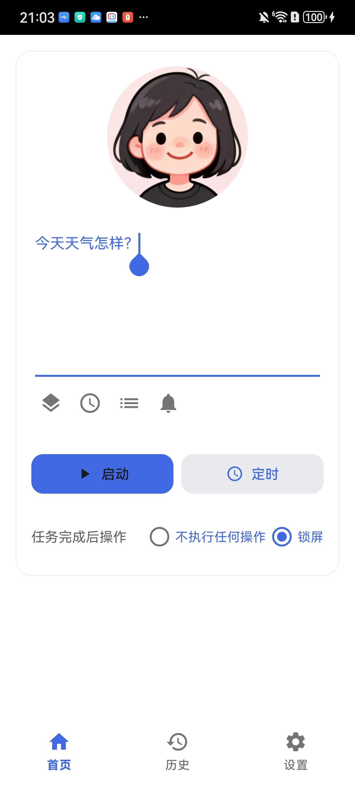</td>
    <td>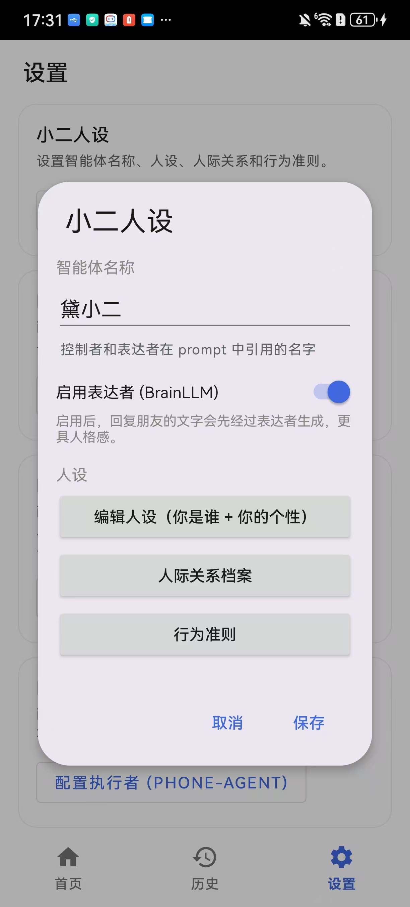</td>
    <td>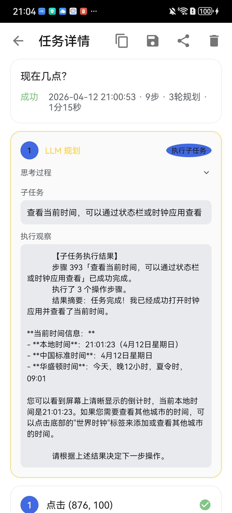</td>
  </tr>
  <tr>
    <td>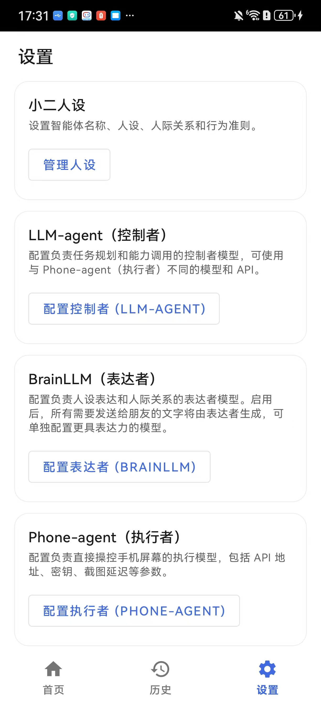</td>
    <td>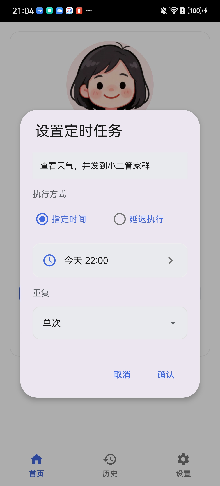</td>
    <td>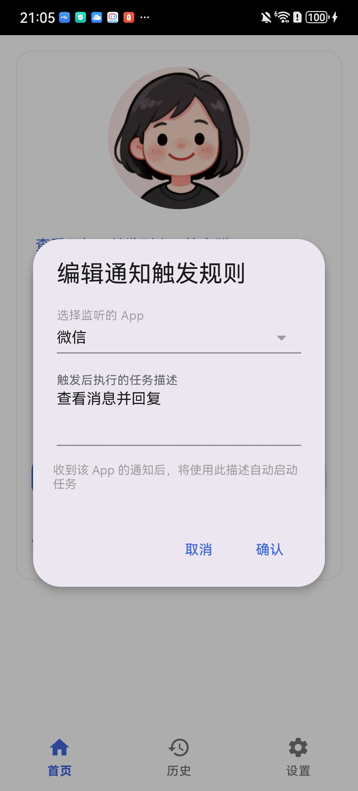</td>
  </tr>
</table>

---

## 📖 项目简介
Auto Xiao'er 是基于 [AutoGLM For Android](https://github.com/Luokavin/AutoGLM-For-Android) 深度修改开发的 Android 原生应用。借鉴一些 OpenClaw 思想，使它可以独立操作手机，成为你的赛博伙伴。

> AutoGLM For Android 是基于 [Open-AutoGLM](https://github.com/zai-org/Open-AutoGLM) 开源项目二次开发的 Android 原生应用。它将原本需要电脑 + ADB 连接的手机自动化方案，转变为一个独立运行在手机上的 App，让用户可以直接在手机上使用自然语言控制手机完成各种任务。


**核心特点：**
- 🚀 **纯端侧**：直接在手机上运行，无需与电脑连接
- 🎯 **无缝对接各种社交软件**：基于视觉操作，手机上可以安装的社交软件都可以使用
- 🤖 **双Agent协同**：大语言模型+视觉操作模型协同，更聪明的智能体
- ⏰ **定时任务**：支持定时执行任务，可设置重复模式，自动亮屏执行
- 🔔 **通知触发**：监听指定 App 的通知，收到通知时自动触发预设任务
- 📶 **微信远程控制**：通过微信扫码连接 ClawBot，随时随地用微信与小二连接
- 🔒 **Shizuku 权限**：通过 Shizuku 获取必要的系统权限
- 🪟 **悬浮窗交互**：悬浮窗实时显示任务执行进度
- 📱 **原生体验**：Material Design 设计，流畅的原生 Android 体验
- 🔌 **多模型支持**：兼容任何支持 OpenAI 格式的模型 API


## 📋 功能特性

### 核心功能

- ✅ **任务执行**：输入自然语言任务描述，AI 自动规划并执行
- ✅ **屏幕理解**：截图 → 视觉模型分析 → 输出操作指令
- ✅ **多种操作**：点击、滑动、长按、双击、输入文本、启动应用等
- ✅ **任务控制**：暂停、继续、取消任务执行
- ✅ **历史记录**：保存任务执行历史，支持查看详情和截图
- ✅ **定时任务**：预设任务在指定时间自动执行，支持一次性和重复任务
- ✅ **通知触发任务**：监听指定 App 通知，自动触发对应任务
- ✅ **微信远程控制（ClawBot）**：通过微信扫码连接，远程发送指令并接收任务执行反馈

### 用户界面

- ✅ **主界面**：任务输入、状态显示、快捷操作
- ✅ **悬浮窗**：实时显示执行步骤、思考过程、操作结果
- ✅ **设置页面**：模型配置、Agent 参数、多配置管理
- ✅ **历史页面**：任务历史列表、详情查看、截图标注

### 高级功能

- ✅ **多模型配置**：支持保存多个模型配置，快速切换
- ✅ **自定义 Prompt**：支持自定义系统提示词
- ✅ **快捷磁贴**：通知栏快捷磁贴，快速打开悬浮窗
- ✅ **日志导出**：支持导出调试日志，自动脱敏敏感信息

## 📱 系统要求

- **Android 版本**：Android 7.0 (API 24) 及以上
- **必需应用**：[Shizuku](https://shizuku.rikka.app/) (用于获取系统权限)
- **网络连接**：需要连接到模型 API 服务（支持任何 OpenAI 格式兼容的视觉模型）
- **权限要求**：
  - 悬浮窗权限 (用于显示悬浮窗)
  - 网络权限 (用于 API 通信)
  - 后台运行权限（用于后台执行任务）
  - Shizuku 权限 (用于执行系统操作)
  - 通知监听权限 (可选，用于通知触发任务功能)

## 🚀 快速开始 （同 AutoGLM-For-Android）

### 第一步：安装并激活 Shizuku

Shizuku 是本应用的核心依赖，用于执行屏幕点击、滑动等操作。

**下载安装**

- [Google Play 下载](https://play.google.com/store/apps/details?id=moe.shizuku.privileged.api)
- [GitHub 下载](https://github.com/RikkaApps/Shizuku/releases)

**激活方式（三选一）**

| 方式      | 适用场景       | 持久性           |
| --------- | -------------- | ---------------- |
| 无线调试  | 推荐，无需电脑 | 重启后需重新配对 |
| ADB 连接  | 有电脑时使用   | 重启后需重新执行 |
| Root 授权 | 已 Root 设备   | 永久有效         |

**无线调试激活步骤（推荐）**

1. 连接任意 WIFI
2. 打开手机「设置」→「开发者选项」
3. 开启「无线调试」
4. 点击「使用配对码配对设备」
5. 等待 Shizuku 通知弹出，在通知内输入配对码完成配对
6. 打开 Shizuku 点击「启动」，等待启动完毕
7. 看到 Shizuku 显示「正在运行」即为成功

<table>
  <tr>
    <td>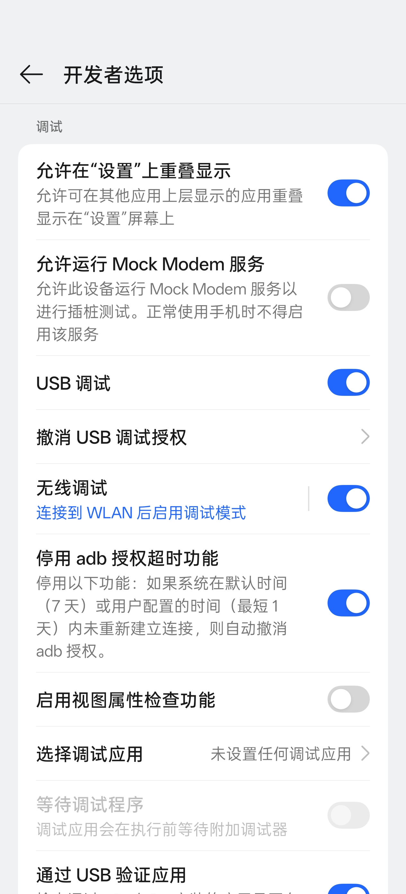</td>
    <td>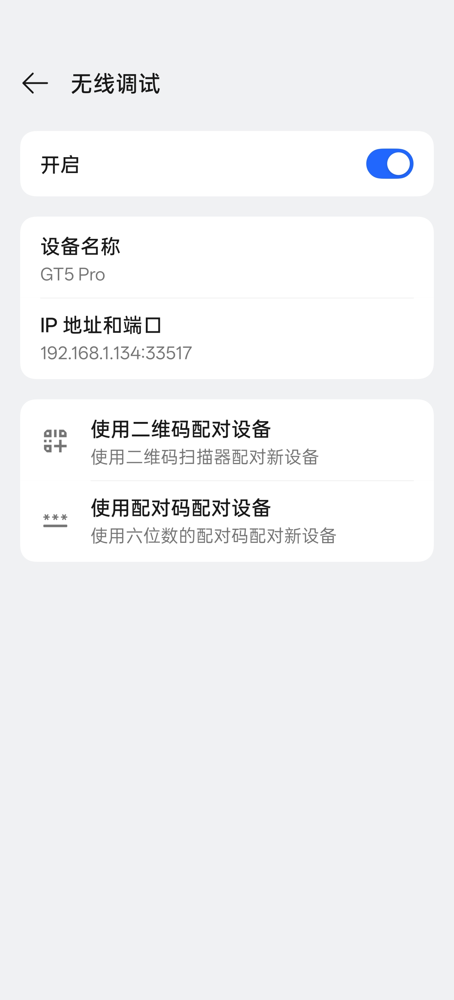</td>
    <td>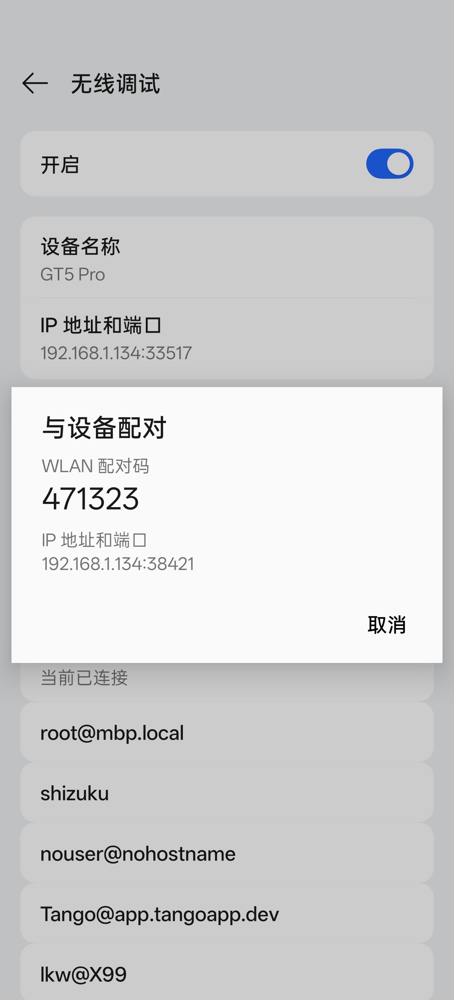</td>
  </tr>
  <tr>
    <td>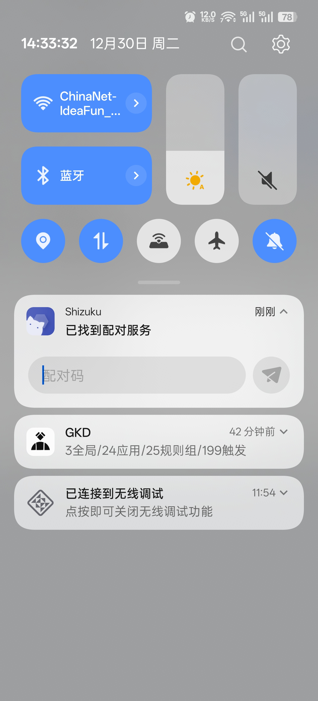</td>
    <td>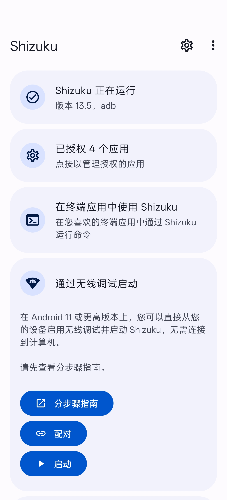</td>
    <td>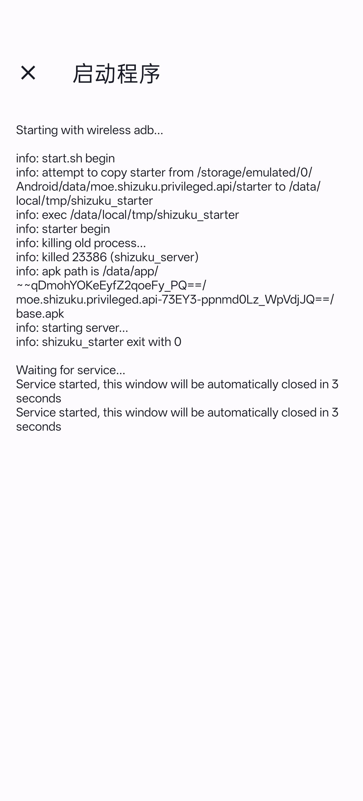</td>
  </tr>
</table>

> 💡 **提示**：如果找不到开发者选项，请在「关于手机」中连续点击「版本号」多次开启。

### 第二步：安装 Auto小二

1. 从 [Releases 页面](https://github.com/Joy-word/AutoXiaoer/releases) 下载最新 APK
2. 安装 APK 并打开应用

### 第三步：授予必要权限

打开应用后，需要依次授予以下权限：

| 权限         | 用途             | 操作                                    |
| ------------ | ---------------- | --------------------------------------- |
| Shizuku 权限 | 执行屏幕操作     | 点击「授权」→ 始终允许                  |
| 悬浮窗权限   | 显示任务执行窗口 | 点击「授权」→ 开启开关                  |
| 键盘权限     | 输入文本内容     | 点击「启用键盘」→ 启用 小二 Keyboard |

<table>
  <tr>
    <td>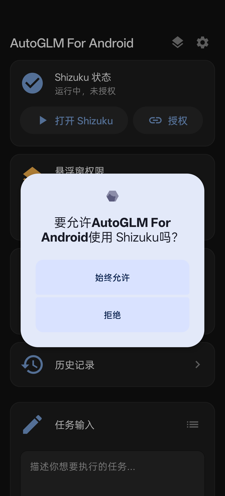</td>
    <td>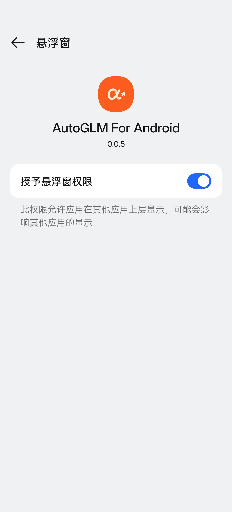</td>
    <td>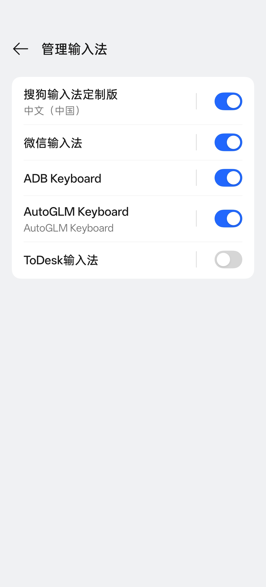</td>
  </tr>
</table>

> 💡 **提示**：如果悬浮窗无法授权，进入应用详情页，点击「右上角菜单」→ 允许受限制的设置，再次尝试授权悬浮窗。

### 第四步：配置模型服务

进入「设置」页面，配置 AI 模型 API。

本应用采用 **双模型双层 Agent 架构**：

| 角色 | 责任 | 推荐模型 |
| ---- | ---- | -------- |
| **LLM Agent（规划层）** | 接收用户任务，通过 ReAct 循环进行高层规划，将复杂任务拆分为子任务 | 纯文本大语言模型（如 GLM-4、DeepSeek） |
| **Phone Agent（执行层）** | 等待子任务，截图分析屏幕并执行具体操作 | 具备图片理解能力的视觉模型（如 autoglm-phone） |

> 两个 Agent 的 API 完全独立配置，可以指向不同的服务提供商。

**Phone Agent 配置（视觉模型）**

**推荐配置（智谱 BigModel）** 🎉 目前 `autoglm-phone` 模型限时免费！

| 配置项   | 值                                                                                |
| -------- | --------------------------------------------------------------------------------- |
| Base URL | `https://open.bigmodel.cn/api/paas/v4`                                            |
| Model    | `autoglm-phone`                                                                   |
| API Key  | 在 [智谱 AI 开放平台](https://open.bigmodel.cn/usercenter/proj-mgmt/apikeys) 获取 |

**备选配置（ModelScope）**

| 配置项   | 值                                           |
| -------- | -------------------------------------------- |
| Base URL | `https://api-inference.modelscope.cn/v1`     |
| Model    | `ZhipuAI/AutoGLM-Phone-9B`                   |
| API Key  | 在 [ModelScope](https://modelscope.cn/) 获取 |

配置完成后，点击「测试连接」验证配置是否正确。

**LLM Agent 配置（规划大语言模型）**

进入设置 → LLM Agent 配置，配置用于规划层的纯文本大语言模型：

| 配置项       | 说明                                              |
| ------------ | --------------------------------------------------- |
| Base URL     | OpenAI 兼容的 API 地址                             |
| Model        | 如 `glm-4-plus`、`deepseek-chat` 等纯文本模型        |
| API Key      | 对应服务的 API Key                             |
| 最大规划步数   | LLM 循环的最大迭act 轮次，默认 20              |
| 自定义系统提示词 | 可重写内置的规划层提示词，优化特定场景的规划行为 |

> 💡 LLM Agent 配置严格独立于 Phone Agent 配置，可以使用任意 OpenAI 格式兼容的纯文本模型。

<table>
  <tr>
    <td>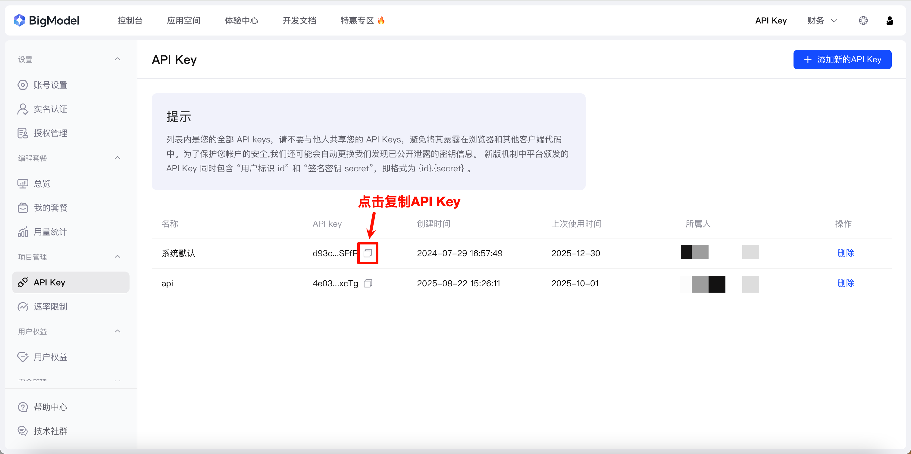</td>
  </tr>
</table>

**使用其他第三方模型**：

只要模型服务满足以下条件，即可在本应用中使用：

1. **API 格式兼容**：提供 OpenAI 兼容的 `/chat/completions` 端点
2. **多模态支持**：支持 `image_url` 格式的图片输入
3. **图片理解能力**：能够分析屏幕截图并理解 UI 元素

> ⚠️ **注意**：非 AutoGLM 模型可能需要调整系统提示词才能正确输出操作指令格式。可在设置 → 高级设置中自定义系统提示词。

### 第五步：开始使用

1. 在主界面输入任务描述，如："打开微信，给文件传输助手发送消息：测试"
2. 点击「开始任务」按钮
3. 悬浮窗会自动弹出，显示执行进度
4. 观察 AI 的思考过程和执行操作

---

## 📖 使用教程

### 基本操作

**启动任务**：

1. 在主界面或悬浮窗输入任务描述
2. 点击「开始」按钮
3. 应用会自动截图、分析、执行操作

**控制任务**：

| 按钮    | 功能                 |
| ------- | -------------------- |
| ⏸️ 暂停 | 在当前步骤后暂停执行 |
| ▶️ 继续 | 恢复暂停的任务       |
| ⏹️ 停止 | 取消当前任务         |

**查看历史**：

1. 点击主界面右上角的「历史」图标
2. 查看所有执行过的任务列表
3. 点击任务可查看详细步骤和截图

**定时任务**：

小二 支持定时任务功能，可预设任务在指定时间自动执行：

1. 在主界面或悬浮窗输入任务描述
2. 点击「定时」按钮打开定时设置对话框
3. 选择执行时间方式：
   - **指定时间**：选择具体的日期和时间
   - **延迟执行**：设置延迟的小时和分钟数
4. 选择重复类型：
   - **仅一次**：执行一次后自动禁用
   - **每天**：每天在相同时间执行
   - **工作日**：周一至周五执行
   - **每周**：每周在同一天执行
5. 点击「确认」保存定时任务
6. 点击主界面右上角的 🕐 图标可查看和管理所有定时任务
7. 到达设定时间后，应用会自动唤醒屏幕并执行任务

**定时任务注意事项**：

- ⚠️ **锁屏限制**：如果手机设置了锁屏密码，息屏状态下定时任务可能无法触发，建议在执行前保持手机解锁状态
- 🔋 **电池优化**：请在系统设置中关闭 小二 的电池优化，避免后台被杀导致定时任务无法执行
- ⏰ **精确定时**：应用使用 AlarmManager 的精确定时功能，即使在 Doze 模式下也能准时触发
- 🔁 **重复任务**：对于重复类型的任务，执行完成后会自动计算下次执行时间并重新调度
- 📱 **开机自启**：设备重启后，应用会自动恢复所有已启用的定时任务

**通知触发任务**：

小二 支持在收到指定 App 的通知时，自动触发预设的任务：

1. 进入「设置」→「通知触发」
2. 授予**通知监听权限**（系统设置 → 通知 → 通知使用权 → 开启 小二）
3. 点击「添加规则」，选择要监听的 App
4. 输入收到通知后希望自动执行的任务描述
5. 点击「确认」保存规则
6. 规则生效后，每当该 App 推送通知，小二 即会自动执行对应任务

**通知触发注意事项**：

- 🔔 **通知监听权限**
小二 无法自动申请
- ⚡ **任务冲突**：若当前已有任务正在运行，新收到的通知触发将被忽略，不会打断正在执行的任务
- 📦 **包名匹配**：规则基于 App 包名精确匹配，同一 App 只会匹配到第一条已启用的规则
- 🔕 **禁用规则**：可随时在规则列表中启用或禁用单条规则，无需删除

**微信远程控制（ClawBot）**：

借助微信 iLink Bot，你可以用微信给手机发指令、接收任务反馈：

1. 进入「设置」→「ClawBot 微信控制」
2. 点击「连接」，使用微信扫描弹出的二维码
3. 扫码并确认后，连接状态变为「已连接」
4. 此后直接在微信中向 Bot 发送任意指令，小二 将自动执行并将结果回复到微信 ClawBot
5. 点击「解绑」可断开连接

**ClawBot 使用注意事项**：

- 📶 **后台保活**：轮询服务在后台长期运行，建议关闭对 小二 的电池优化
- 🔄 **自动恢复**：应用重启后会自动恢复 ClawBot 连接，无需重新扫码
- ⚡ **任务冲突**：若当前已有任务正在运行，新收到的通知触发将被忽略，不会打断正在执行的任务
- 🔒 **会话过期**：若微信 Bot 会话过期，应用会通知你重新扫码登录


### 任务示例大全

**社交通讯**

```
打开微信，搜索张三并发送消息：明天有空吗？
打开微信，查看朋友圈最新动态
```

**购物搜索**

```
打开淘宝，搜索无线耳机，按销量排序
打开京东，搜索手机壳，筛选价格50元以下
```

**外卖点餐**

```
打开美团，搜索附近的火锅店
打开饿了么，点一份黄焖鸡米饭
```

**出行导航**

```
打开高德地图，导航到最近的地铁站
打开百度地图，搜索附近的加油站
```

**视频娱乐**

```
打开抖音，刷5个视频
打开B站，搜索编程教程
```

**定时任务场景**

```
每天早上7点：打开新闻客户端，查看今日头条
工作日早上8:30：打开钉钉，自动打卡
每天晚上22点：打开喜马拉雅，播放睡前故事
每周一早上9点：打开备忘录，查看本周待办事项
```

**通知触发场景**

```
监听「京东」通知 → 打开京东，查看最新优惠券
监听「微信」通知 → 打开微信，查看未读消息并回复
```

**微信远程控制场景（ClawBot）**

```
（在微信中发送给 Bot）查询电量
（在微信中发送给 Bot）拍一张照片发给我
（在微信中发送给 Bot）帮我把手机调成静音模式
```

### 高级功能

**保存模型配置**：

如果你有多个模型 API，可以保存为不同配置：

1. 进入「设置」→「模型配置」
2. 配置好参数后点击「保存配置」
3. 输入配置名称（如：智谱、OpenAI）
4. 之后可在配置列表中快速切换

**创建任务模板**：

将常用任务保存为模板，一键执行：

1. 进入「设置」→「任务模板」
2. 点击「添加模板」
3. 输入模板名称和任务描述
4. 在主界面点击模板按钮快速选择

**自定义系统提示词**：

针对特定场景优化 AI 表现：

1. 进入「设置」→「高级设置」
2. 编辑系统提示词
3. 添加特定领域的指令增强

**快捷磁贴**：

在通知栏添加快捷磁贴，快速打开悬浮窗：

1. 下拉通知栏，点击编辑图标
2. 找到「小二」磁贴
3. 拖动到快捷磁贴区域

**导出调试日志**：

遇到问题时，可导出日志用于排查：

1. 进入「设置」→「关于」
2. 点击「导出日志」
3. 日志会自动脱敏敏感信息


## 🔧 常见问题

### Shizuku 相关

**Q: Shizuku 显示未运行？**

A: 确保 Shizuku 已安装并打开，按指引激活服务。推荐使用无线调试方式。

**Q: 每次重启后 Shizuku 失效？**

A: 无线调试方式需要重新配对。可考虑：

- Root 方式永久激活
- 使用 ADB 方式激活

### 权限相关

**Q: 悬浮窗权限无法授予？**

A: 手动操作：系统设置 → 应用 → 小二 → 权限 → 开启「显示在其他应用上层」

**Q: 键盘无法启用？**

A: 手动操作：系统设置 → 语言和输入法 → 管理键盘 → 启用 小二 Keyboard


**Q: 无法在后台运行？**
A: 手动操作：系统设置 → 应用启动管理 → 小二 → 手动管理 → 允许后台活动
### 操作相关

**Q: 点击操作不生效？**

A:

1. 检查 Shizuku 是否正在运行
2. 部分系统需开启「USB 调试(安全设置)」
3. 尝试重启 Shizuku

**Q: 文本输入失败？**

A:

1. 确保 小二 Keyboard 已启用
2. 尝试手动切换一次输入法后再执行任务

**Q: 截图显示黑屏？**

A: 这是敏感页面（支付、密码等）的正常保护机制，应用会自动检测并标记。

### 模型相关

**Q: API 连接失败？**

A:

1. 检查网络连接
2. 确认 API Key 是否正确
3. 确认 Base URL 格式正确（末尾不要加 `/`）

**Q: 模型响应很慢？**

A:

1. 检查网络质量
2. 尝试切换其他模型服务
3. 在设置中调整超时时间

### 定时任务相关

**Q: 定时任务没有按时触发？**

A:

1. 检查系统设置中是否关闭了 小二 的电池优化
2. 确保应用没有被系统后台清理
3. 部分手机需要在设置中允许应用「后台运行」和「自启动」
4. 查看任务列表确认任务是否处于启用状态

**Q: 定时任务触发后无法执行？**

A:

1. 如果手机设置了锁屏密码，需要在任务执行前保持解锁状态
2. 确认 Shizuku 服务正在运行（重启后 Shizuku 需要重新激活）
3. 检查是否有其他任务正在执行，定时任务不会打断正在运行的任务

**Q: 设备重启后定时任务失效？**

A: 应用已设置开机自启动来恢复定时任务，但部分手机系统需要手动授权：

1. 进入系统设置 → 应用管理 → 小二
2. 开启「自启动」或「开机启动」权限
3. 关闭电池优化
4. 如果 Shizuku 使用无线调试方式，重启后需要重新配对激活

**Q: 重复任务只执行了一次？**

A:

1. 检查任务是否被误设置为「仅一次」模式
2. 查看任务列表确认任务仍处于启用状态
3. 如果执行失败，重复任务会自动调度到下次执行时间

### ClawBot 微信控制相关

**Q: 扫码后连接状态一直显示「等待扫码」？**

A:

1. 确认微信已扫描二维码
2. 微信内确认授权页面需要点击「确认」才能完成绑定
3. 二维码有效期较短，可关闭对话框后重新点击「连接」获取新的二维码

**Q: 连接成功后微信收不到任务执行结果？**

A:

1. 确认已关闭 小二 的电池优化，避免后台轮询服务被系统杀死
2. 检查手机是否有网络连接
3. 在设置中检查 ClawBot 连接状态是否仍为「已连接」

**Q: 应用提示「会话已过期，请重新连接」？**

A: 微信 iLink Bot 的会话有效期有限，重新进入「设置」→「ClawBot 微信控制」，点击「连接」重新扫码授权即可。

**Q: 重启手机后 ClawBot 连接断开？**

A: 应用重启后会自动恢复轮询，无需重新扫码。如果连接失效，通常是会话过期导致，重新扫码一次即可。建议关闭 小二 的电池优化并允许自启动。

**Q: 微信指令没有被执行？**

A:

1. 确认当前没有其他任务正在运行（ClawBot 指令不会打断已运行的任务）
2. 检查 Shizuku 服务是否正在运行
3. 确认悬浮窗权限已授予

### 通知触发相关

**Q: 通知触发功能没有反应？**

A:

1. 确认已在系统设置中授予通知监听权限：系统设置 → 通知 → 通知使用权 → 开启 小二
2. 确认规则已处于启用状态（规则列表中开关为开启）
3. 检查手机是否设置了电池优化将 小二 后台进程杀死
4. 部分手机需要在设置中允许 小二「后台运行」和「自启动」

**Q: 通知触发后没有执行任务？**

A:

1. 如果当前已有任务正在运行，新的通知触发会被忽略，等待当前任务完成后再尝试
2. 检查 Shizuku 服务是否正在运行
3. 确认悬浮窗权限已授予
4. 查看日志（设置 → 关于 → 导出日志）排查具体原因

**Q: 如何停止通知触发功能？**

A: 可以在规则列表中关闭对应规则的开关，或者在系统设置中撤销 小二 的通知监听权限。

## ⚠️ 安全与隐私风险提示

在使用本应用前，请务必了解以下风险：

### 安全限制基于提示词

本应用的安全行为限制（如拒绝执行危险操作）**依赖于 AI 模型的系统提示词实现**，并非底层硬性约束。这意味着：

- 提示词可能被精心构造的任务描述绕过（即"提示词注入"攻击）
- 不同模型对同一提示词的遵从程度存在差异
- **请勿将本应用用于涉及敏感账户、资金操作、隐私数据等高风险场景**

### 模型 API 数据安全

- 本应用所有 AI 功能均通过**用户自行配置的第三方模型 API** 实现
- 应用本身不收集、不上传、不存储任何用户数据或截图内容
- 任务执行过程中的截图会通过你配置的 API 发送至对应的模型服务商
- **请确保你信任所使用的模型服务商，并仔细阅读其隐私政策**

### 使用建议

- 🔒 敏感页面（支付、密码输入框等）会触发系统保护，截图显示为黑屏
- 👀 建议在执行涉及敏感任务时保持对屏幕操作的观察，随时准备手动干预
- 🔑 不要在任务描述中包含密码、验证码等敏感信息

---

## 📄 开源协议

本项目基于 [MIT License](LICENSE) 开源。

## ⭐ Star History

[](https://star-history.com/#Joy-word/AutoXiaoer&Date)

## 🙏 致谢

- [AutoGLM-For-Android](https://github.com/Luokavin/AutoGLM-For-Android) Luokavin 大佬开源项目
- [Open-AutoGLM](https://github.com/zai-org/Open-AutoGLM) - 原始开源项目
- [Shizuku](https://github.com/RikkaApps/Shizuku) - 系统权限框架
- [智谱 AI](https://www.zhipuai.cn/) - AutoGLM 模型提供方

## 📞 联系方式

- Email: wxrachel@outlook.com

---

<div align="center">

**如果这个项目对你有帮助，请给一个 ⭐ Star！**

</div>
